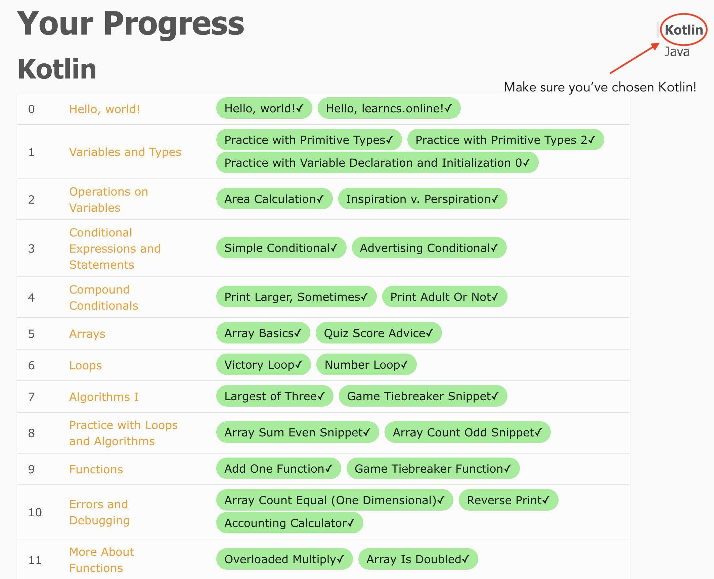

# Intro to Kotlin
Hey! We're going to learn Kotlin! In particular, we're going to learn the use of Kotlin for the development of mobile apps. As general-purpose programming language, Kotlin can be used for pretty much anything, but it's main use these days is as the language of choice for Android app development. However, Kotlin probably isn't your first programming language, and I'm going to assume you have some programming background already, probably with a statically-typed programming language.
## Static vs dynamic typing
<iframe width="560" height="315" src="https://www.youtube.com/embed/-3SYtaQ-EKM" title="YouTube video player" frameborder="0" allow="accelerometer; autoplay; clipboard-write; encrypted-media; gyroscope; picture-in-picture" allowfullscreen></iframe>

## Basic types
<iframe width="560" height="315" src="https://www.youtube.com/embed/44V7YRafc0o" title="YouTube video player" frameborder="0" allow="accelerometer; autoplay; clipboard-write; encrypted-media; gyroscope; picture-in-picture" allowfullscreen></iframe>

## Programming language fundamentals
Even if you have limited experience with statically-typed languages there are many common programming techniques that you will recognize in Kotlin, including things like functions, collections, control flow and strings. We'll examine all of these in a basic Kotlin sense.

## Primary resources
### Kotlin Docs
The official [Kotlin Docs](https://kotlinlang.org/docs/home.html) site covers everything that you might need to know about Kotlin. Watch the video below to see how we'll use the docs.
<iframe width="560" height="315" src="https://www.youtube.com/embed/jRnfU9l3H_s" title="YouTube video player" frameborder="0" allow="accelerometer; autoplay; clipboard-write; encrypted-media; gyroscope; picture-in-picture" allowfullscreen></iframe>

### Kotlin by Example
[Kotlin by Example](https://play.kotlinlang.org/byExample/overview) is "an official set of small and simple annotated examples designed for those new to Kotlin". Although many of these examples leave out more details than we'd like, this is an excellent resource, and we'll use it as a base for review and practice. Watch the video below to see how we'll use Kotlin by Example. 
<iframe width="560" height="315" src="https://www.youtube.com/embed/jCa8nmG36ns" title="YouTube video player" frameborder="0" allow="accelerometer; autoplay; clipboard-write; encrypted-media; gyroscope; picture-in-picture" allowfullscreen></iframe>

### LearnCS.online
[LearnCS.online](https://www.learncs.online) is web-based course for new programmers developed by Geoffrey Challen at the University of Illinois. The work Geoffrey and his team has done to develop this course is phenomenal, and Geoffrey has ensured that the course is open and free for anyone to use. Although the course is written for an audience with no programming experience, there is a lot we can take from it. Watch the video below to see how we'll use LearnCS.online.
<iframe width="560" height="315" src="https://www.youtube.com/embed/ahomOzggrnk" title="YouTube video player" frameborder="0" allow="accelerometer; autoplay; clipboard-write; encrypted-media; gyroscope; picture-in-picture" allowfullscreen></iframe>

# Homework and activities
For each row below you should read/examine/experiment with the given Kotlin by Example column, then attempt the corresponding exercises given in the LearnCS.online column. Some Kotlin by Example topics do not have corresponding LearnCS.online exercises - just move on to the next Kotlin by Example and those topics will come up in later exercises.

As part of this homework we're going to begin the reflective process, but we're going to keep it light for this week. [This Google document](https://docs.google.com/document/d/1jS3eqGchO_-E8LXC9LR0kUS0prirYF4ujeUhkhcZzn4/edit?usp=sharing) is a checklist of all the exercises listed in the table below. Beside each item is a blank space where you may quickly state whether you found each exercise easy, challenging, or too difficult. See the video below for an example.

| **Kotlin by Example** | **LearnCS.online** |
| --- | --- |
| [Hello World](https://play.kotlinlang.org/byExample/01_introduction/01_Hello%20world) | [Hello, learncs.online!](https://www.learncs.online/practice/kotlin/hello-learncs-online) 
|| [Hello, world!](https://www.learncs.online/practice/kotlin/hello-world) |
| [Variables](https://play.kotlinlang.org/byExample/01_introduction/03_Variables) | [Practice with Primitive Types](https://www.learncs.online/practice/kotlin/practice-with-primitive-types)
|| [Practice with Primitive Types 2](https://www.learncs.online/practice/kotlin/practice-with-primitive-types-2)
|| [Practice with Variable Declaration and Initialization 0](https://www.learncs.online/practice/kotlin/practice-with-primitive-types-learncsonline)
|| [Area Calculation](https://www.learncs.online/practice/kotlin/area-calculation)
|| [Inspiration v. Perspiration](https://www.learncs.online/practice/kotlin/inspiration-v-perspiration) |
| [Functions](https://play.kotlinlang.org/byExample/01_introduction/02_Functions) | [Add One Function](https://www.learncs.online/practice/kotlin/add-one-function)
|| [Is Odd](https://www.learncs.online/practice/kotlin/is-odd)
|| [Overloading Multiply](https://www.learncs.online/practice/kotlin/overloaded-multiply) |
| Collections (recall the earlier video about types for this) | [Array Basics](https://www.learncs.online/practice/kotlin/array-basics) |
| [When](https://play.kotlinlang.org/byExample/02_control_flow/01_When) and [Conditional Expression](https://play.kotlinlang.org/byExample/02_control_flow/05_Conditional%20expression) | [Simple Conditional](https://www.learncs.online/practice/kotlin/simple-conditional)
|| [Advertising Conditional](https://www.learncs.online/practice/kotlin/advertising-conditional)
|| [Largest of Three](https://www.learncs.online/practice/kotlin/largest-of-three)
|| [Quiz Score Advice](https://www.learncs.online/practice/kotlin/quiz-score-advice)
|| [Print Adult or Not](https://www.learncs.online/practice/kotlin/print-adult-or-not)
|| [Print Larger, Sometimes](https://www.learncs.online/practice/kotlin/print-larger-sometimes)
|| [Game Tiebreaker Snippet](https://www.learncs.online/practice/kotlin/game-tiebreaker-snippet) |
| [Equality Checks](https://play.kotlinlang.org/byExample/02_control_flow/04_Equality%20Checks) | |
| [Ranges](https://play.kotlinlang.org/byExample/02_control_flow/03_Ranges) | |
| [Loops](https://play.kotlinlang.org/byExample/02_control_flow/02_Loops) | [Number Loop](https://www.learncs.online/practice/kotlin/number-loop)
|| [Victory Loop](https://www.learncs.online/practice/kotlin/victory-loop)
|| [Array Count Odd Snippet](https://www.learncs.online/practice/kotlin/array-count-odd-snippet)
|| [Array Sum Even Snippet](https://www.learncs.online/practice/kotlin/array-sum-even-snippet)
|| [Accounting Calculator](https://www.learncs.online/practice/kotlin/accounting-calculator)
|| [Reverse Print](https://www.learncs.online/practice/kotlin/reverse-print) |

Additionally, complete the following LearnCS.online exercises for more practice:

* [Array Count Equal (One Dimensional)](https://www.learncs.online/practice/kotlin/array-count-equal-one-dimensional)
* [Catchup Quiz Grading](https://www.learncs.online/practice/kotlin/catchup-quiz-grading)
* [Array Is Doubled](https://www.learncs.online/practice/kotlin/array-is-doubled)
* [Game Tiebreaker Function](https://www.learncs.online/practice/kotlin/game-tiebreaker-function#game-tiebreaker-function)

If you have logged into the LearnCS.online site then when you are done your [progress](https://www.learncs.online/progress#kotlin) should look like the following (note the green and checkmarks):

# Assignments

