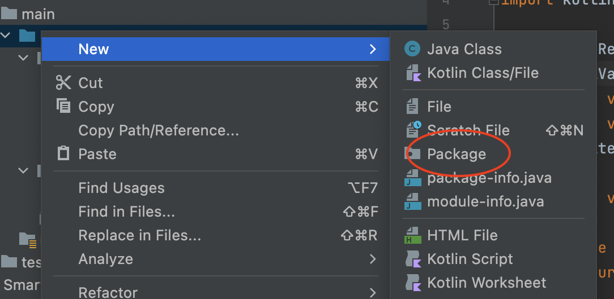

# 

# Object-oriented programming - part 2
---
In this second week devoted to object-oriented programming we examine some of the more modern language and Kotlin-specific features available to us. In particular: Kotlin provides a number of special keywords for commonly used class patterns; and native support for both the Singleton and the Delegation patterns. 

The following video is a pretty long one! Over an hour! But I've added chapters to divide it into fairly manageable sections (see the links in the video description). Each section speaks to one of the text and examples sections below, but in the context of a more coherent project. The project itself is, admittedly, still very much a toy example, but I think a more meaningful one than the service station. You can find the code for the project in the [smartapp repository](https://github.com/nic-dgl-204-fall-2022/smartapp). And here is a [link to the codelab](https://developer.android.com/codelabs/basic-android-kotlin-compose-classes-and-objects) that the smartapp project is derived from.

<iframe width="560" height="315" src="https://www.youtube.com/embed/TEG2wzWsdAc" title="YouTube video player" frameborder="0" allow="accelerometer; autoplay; clipboard-write; encrypted-media; gyroscope; picture-in-picture" allowfullscreen></iframe>

This next video is much shorter, but points out a few relevant examples from the topics below in a more actualized project. The project is the [Mars Photos project](https://github.com/google-developer-training/basic-android-kotlin-compose-training-mars-photos), which may be familiar to you prior DGL 114 students, with the key difference that this particular implementation of Mars Photos uses [Jetpack Compose](https://developer.android.com/jetpack/compose). If you're interested, [this is the codelab](https://developer.android.com/codelabs/basic-android-kotlin-compose-getting-data-internet) that helps you build the Mars Photos app.

> Important note: The video below demonstrates the Mars Photos app in Android Studio - not in IntelliJ IDEA.

<iframe width="560" height="315" src="https://www.youtube.com/embed/brAU9yZwc04" title="YouTube video player" frameborder="0" allow="accelerometer; autoplay; clipboard-write; encrypted-media; gyroscope; picture-in-picture" allowfullscreen></iframe>

## Special classes
We've already looked at `open` and `abstract` classes, which are used as part of the standard OOP inheritance model. There are a number of additional class modifiers that you might elect to use at different times:

### Final classes
Remember that to make a class inheritable it must be annotated with either the `open` or `abstract` keywords. Classes are closed, or `final` by default, so using the `final` keyword at the class level isn't actually all that useful; even subclasses of `open` classes are `final` by default, so using the keyword is actually redundant:

```kotlin
// final here is unnecessary...
final class FinalClass() 
```

More likely, you'll use `final` to declare that a method cannot be inherited (note that the `open` keyword is still required to make a method inheritable, but the semantics of the `final` keyword are more useful here):

```kotlin
class FinalClass() {
    final fun NotInheritable() 
}
```

### Data classes
[Data classes](https://play.kotlinlang.org/byExample/03_special_classes/01_Data%20classes) are a great way to hold data! When it comes to developing mobile apps there are plenty of situations where it is necessary to develop custom classes to hold some form of data, likely in a database. Data classes are declared with the `data` keyword and are often empty:

```kotlin
data class User(val name: String, val id: Int)
```

Although the `User` class above doesn't explicitly inherit from any other classes or interfaces, the `data` keyword provides a bunch of useful bells and whistles to the class, specifically:
- A sensible `toString()` method
- An `equals()` method that tests referential equality
- A `hashCode()` method that produces a deterministic hash
- A `copy()` method that permits copying an instance in whole or part
- A `componentN()` method that can be used to access the values stored in each class property, indexed by `N`

### Enum classes
[Enum classes](https://play.kotlinlang.org/byExample/03_special_classes/02_Enum) might just be called 'enums' in other languages. In Kotlin they are created using both the `enum` and the `class` keyword for consistency with the other class types, as above. Enum classes are used to hold a distinct set of values, and often values that represent state, or data.

The really nice part about Enum classes is that because an `enum` declares _all_ the possible values for its class instances, it means that it can be used in a `when` expression or statement without the need for the catch-all `else` clause:

```kotlin
// It's pretty typical to write enum values in all caps
enum class State {
    IDLE, RUNNING, FINISHED
}

// So when the enum values are used, because they're all caps, it's really obvious that they belong to an enum
val state = State.RUNNING
val message = when (state) {
    State.IDLE -> "It's idle"
    State.RUNNING -> "It's running"
    State.FINISHED -> "It's finished"
    // Notice we don't need an else clause here
}
```

Compare the above to the `when` below, where it is a) infeasible to account for all possible states of the `val` `x`; and b) necessary to include the `else` clause because see (a) (is this recursive? o.O - no, just circular! :D)

```kotlin
val x: Int // Initialized elsewhere through some other process...
val message = when(x) {
    1 -> "one"
    2 -> "two"
    else -> "more than two"
}
```

### Sealed classes
[Sealed classes](https://play.kotlinlang.org/byExample/03_special_classes/03_Sealed%20Classes) are used to make a class inheritable from _within the same package_. This is a bit akin to the `protected` keyword in other languages, where inheritance is permitted under certain conditions. 

Defining [packages](https://kotlinlang.org/docs/packages.html#overriding-properties) in Kotlin is pretty easy: you just have include the `package` declaration (with the correct path) at the top of your file - like an import. With IntelliJ IDEA (or Android Studio) it's even easier: just create a new package in your working `src` directory and any file created in that package will automatically have the correct `package` annotation.



## Objects
The [singleton pattern](https://en.wikipedia.org/wiki/Singleton_pattern) is one of the best-known, or often used, of the software design patterns. There are a variety of reasons one might decide to use the singleton pattern, including as part of other design patterns; but at the most fundamental the singleton pattern permits the creation of an guaranteed singular object instance. 

Why would ever want to know that you have one - and only one! - instance of a particular class? What if you had some shared state that you needed to check from a variety of different locations in your code? Global variables are not a good solution, and passing around an instance can be cumbersome and can reduce readability. 

If, instead, we have global access to a singular instance of a particular class, we can encapsulate all that instance's members so they don't enter the global namespace, but also give access to whatever state and behaviour that instance holds. This is a great solution for database-related code, or for any sort of multi-threaded program.

In Kotlin, the singleton pattern is natively supported via [object declaration](https://kotlinlang.org/docs/object-declarations.html#object-declarations-overview) and more directly via companion objects.

```kotlin
class Singleton() {
    // The companion object defines the actual singleton
    companion object {
        val name = this.toString()
        val count = 0
        fun incrementCount() = count++
    }
}

fun main() {
    // Calling on Singleton induces the companion object
    println(Singleton.name)
    println(Singleton.incrementCount()) // prints 0
    println(Singleton.incrementCount()) // prints 1
}
```

## Delegation
The best way to keep straight the meaning and purpose of _delegation_ is to recall the definition of _delegate_: "to give part of your work, power, or authority to someone in a lower position than you" [Oxford Learner's Dictionary](https://www.oxfordlearnersdictionaries.com/us/definition/american_english/delegate_2). In effect, this means that when you write a program that follows the [delegation pattern](https://en.wikipedia.org/wiki/Delegation_pattern) that _some_ part of your code is passing on _responsibility_ for some action/behaviour to _another_ part of your code.

Ok, so what does this mean in practice? Based the above we _might_ be tempted to think of code like the following as an example of delegation:

```kotlin
class A {
    fun pr() {
        println("Printed from A")
    }   
}

class B(val a : A) {
    fun pr() {
        a.pr()
    }
}

fun main() {
    val a = A()
    val b = B(a)
    b.pr()
}
```

However, this is **not** an example of delegation: In the code above the `b` object instance takes the object instance `a` as an argument, then when `b.pr()` is called `a.pr()` is called in turn. This is, in fact, one example of [forwarding](https://en.wikipedia.org/wiki/Forwarding_(object-oriented_programming)) behaviour, not delegation.

In Kotlin delegation is handled natively, which means that the language grammar makes writing delegated calls easy, and readable, and not strange and scary. In fact, when delegating in Kotlin, you don't have to think too much about what delegation really _is_, as long as you follow the pattern as [demonstrated here in Kotlin by Example](https://play.kotlinlang.org/byExample/07_Delegation/01_delegationPattern) and proscribed by this example from the documentation:

```kotlin
// The interface acts as a map for the sending class to identify the potential actions its delegate might take
interface Base {
    fun print()
}

// This is the delegate class, or receiving object, that will eventually take the action. 
// Notice that the delegate class is the one to *implement* the interface method
class BaseImpl(val x: Int) : Base {
    override fun print() { print(x) }
}

// This is the delegator class, or sending object, that requests an action 
// Notice that the delegator calls its delegate using the `by` keyword
class Derived(b: Base) : Base by b

fun main() {
    val b = BaseImpl(10) // Instantiates the delegate 
    val d = Derived(b) // Instantiates the delegator
    d.print() // Prints: 10
}
```

If, however, you are interested in the internals of the delegation pattern it comes down to how the sending object passes a reference to itself to the receiving object to ensure that the receiving object can take action in the _context_ of the sending object. This is perhaps most clearly demonstrated by the related [delegated properties](https://play.kotlinlang.org/byExample/07_Delegation/02_DelegatedProperties) pattern.

# Homework and activities
---

## Programming challenges 5
Follow the directions below to access the first set of programming challenges and complete them according to the directions.

### To access the programming challenges:
1. Log into GitHub with your chosen account.
2. [Click here](https://classroom.github.com/a/qp0wyfN_) to accept the assignment from GitHub Classroom.
3. Once the assignment has been generated you may clone it locally to your harddrive.
4. Follow the directions in the programming challenge `README.md` file to complete the assignment.