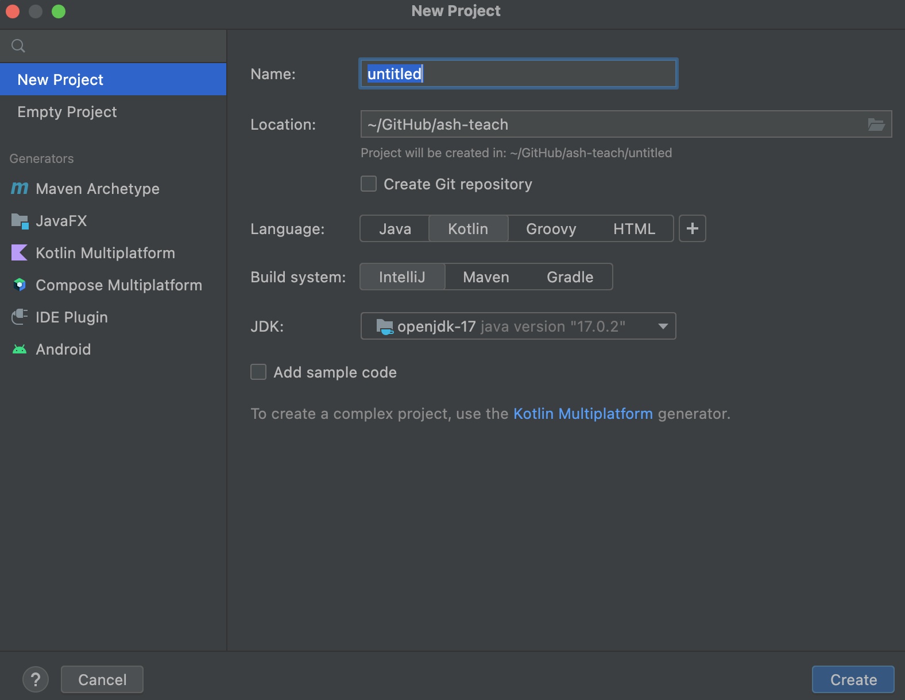
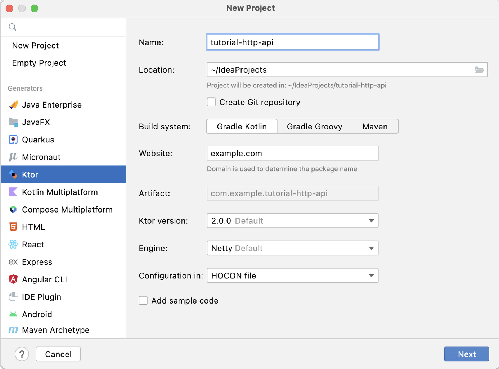
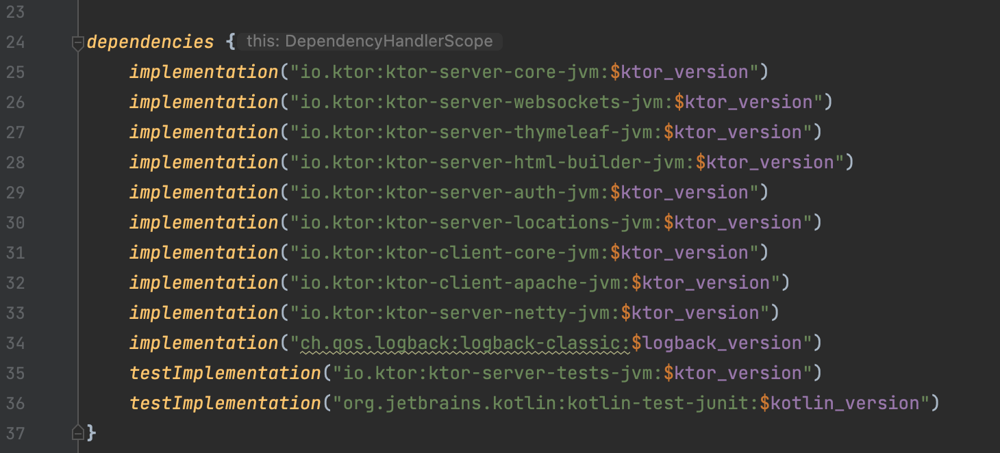
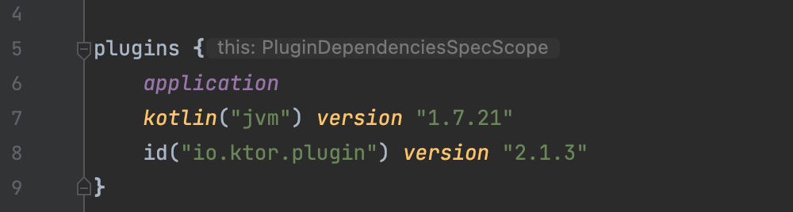

# 

# Server-side development with Ktor
---
A key reason that we've spent time in this course in looking at Kotlin-specific code and using IntelliJ IDEA rather than Android Studio is to facilitate the development of server-side code for mobile applications. While our DIGITAL programs focus more on front-end development in both web and mobile applications, having some knowledge and experience in back-end development will serve you well.

To that end, this week we introduce [Ktor](https://ktor.io/), which is JetBrains' in-house developed framework for web-based application development. Ktor provides both [server-side](https://ktor.io/docs/intellij-idea.html) and [client-side](https://ktor.io/docs/getting-started-ktor-client.html) tooling and provides support for [multi-platform applications](https://ktor.io/docs/getting-started-ktor-client-multiplatform-mobile.html). 

<iframe width="560" height="315" src="https://www.youtube.com/embed/UtFU01ALJe0" title="YouTube video player" frameborder="0" allow="accelerometer; autoplay; clipboard-write; encrypted-media; gyroscope; picture-in-picture" allowfullscreen></iframe>

## Developing a Ktor application
This week we're going to examine code based on two Ktor tutorials: [Creating HTTP APIs](https://ktor.io/docs/creating-http-apis.html) and [Creating a static website](https://ktor.io/docs/creating-static-website.html). The videos below walk through these tutorials, but provide a little additional context that isn't covered in each.

<iframe width="560" height="315" src="https://www.youtube.com/embed/6G8tCzYkliQ" title="YouTube video player" frameborder="0" allow="accelerometer; autoplay; clipboard-write; encrypted-media; gyroscope; picture-in-picture" allowfullscreen></iframe>

## Ktor project generator
When creating a new project using the New > Project... dialog in IntelliJ IDEA **CE** you'll likely get a window like the following:

On the other hand, the IntelliJ IDEA **Ultimate** New > Project... dialog looks something more like this:

Notice the many more options available for project generators. In other words, the Ultimate license does provide more deployment options for your code (remember that students are [eligible for an IntelliJ IDEA Ultimate license!](https://www.jetbrains.com/community/education/#students)).

In order to support all potential users the [Ktor Project Generator](https://start.ktor.io) can be used to generate the starting code for any Ktor project. Remember when using the project generator to make any necessary modifications to the default settings:

and to install any required plugins:

Once you've generated the project you can download the resulting zip file and uncompress it to the location of your choice then open via IntelliJ IDEA. 

## Ktor dependencies and plugins
The wide breadth of functionality available to Ktor applications is provided primarily through [plugins](https://ktor.io/docs/plugins.html), which are effectively additional APIs that support commonly-required features. All available Ktor modules are listed in the [Ktor public API](https://api.ktor.io/index.html).

Plugins are added to a Ktor project via dependencies (Gradle or Maven). The image below demonstrates what a series of dependencies might look like in a `build.gradle` file:

Note that Ktor plugins added via the `dependencies` Gradle object are different from those plugins listed in the Gradle `plugins` object, also found in the `build.gradle` file:

The plugins in the `plugins` object are plugins for IntelliJ IDEA - which in this case allow us to target development on the JVM, and to use Ktor in the IDE - and are not implementations of specific APIs for Ktor features.

### Gradle vs Maven
Both [Gradle](https://gradle.org/) and [Maven](https://maven.apache.org/) are [build tools](https://en.wikipedia.org/wiki/Build_automation) used to manage project dependencies and to support automation in integrations and build processes. Maven is slightly older, and Gradle has been developed with improvements to Maven's approach in mind. You can read a (somewhat biased - but likely honest...) [comparison between Gradle and Maven](https://gradle.org/maven-vs-gradle/) on the Gradle site.

For our purposes, Gradle is generally a better option. Gradle has jumped fully into Kotlin support, and is the Google-recommended build tool for Android projects and comes bundled with Android Studio and IntelliJ IDEA. Most importantly, Gradle provides a Kotlin-based [domain-specific language (DSL)](https://en.wikipedia.org/wiki/Domain-specific_language) that enables the use of Kotlin-like syntax in both IntelliJ IDEA and Android Studio. This is a big plus for Kotlin projects, as it reduces the need for alternative forms of configuration using XML derivatives. You can read a bit more about the [Kotlin DSL](https://gradle.org/kotlin/) on the Gradle site.

## Annotations
[Annotations in Kotlin](https://kotlinlang.org/docs/annotations.html) are a way of attaching additional meta-data to Kotlin code. Annotations typically do not directly affect code, although they can be used to ensure conformance to particular conventions, or to provide additional context to runtime code. Annotations are denoted with the `@` symbol and their placement in a Kotlin file is subject to [coding conventions](https://kotlinlang.org/docs/coding-conventions.html#annotations).

At this point, you may hve run into one or more of the [standard library annotations](https://kotlinlang.org/api/latest/jvm/stdlib/kotlin/-annotation.html): most likely [`@Suppress`](https://kotlinlang.org/api/latest/jvm/stdlib/kotlin/-suppress/), or perhaps you've seen meta-data presented as a result of the [`@Deprecated`](https://kotlinlang.org/api/latest/jvm/stdlib/kotlin/-deprecated/) annotation.

Some Kotlin libraries, like [Room Persistence Library](https://developer.android.com/jetpack/androidx/releases/room) use annotations extensively to support required implementation steps. When using Ktor you may notice some annotations, such as `@Serializable` from the [serialization library](https://kotlinlang.org/docs/serialization.html) and [`@Resource`](https://ktor.io/docs/type-safe-routing.html#resource_classes). However, don't confuse annotations with [return-to labels](https://kotlinlang.org/docs/returns.html#return-to-labels), or similar, the `@` symbol is used in multiple syntactic conventions in Kotlin!

# Homework and activities
---
## Midterm 
- Next week

## Project 1
- Due in two weeks
## Recommended practice exercises
The following exercises are highly recommended as practice problems to get you oriented to using Kotlin.