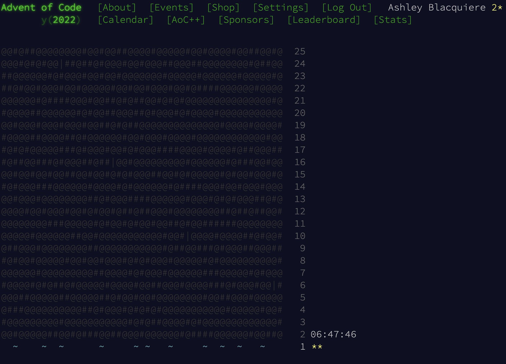

# 

# Course wrap-up
---
This is the end, my friends! It's been a shorter than normal semester, and it certainly did seem to get to the end rather quickly. In this final post I'd like to wrap up a couple ideas and provide some advice and resources for future Kotlin work.

For those of you who have been in DGL 104 recently, you know a bit about my feelings towards open source communities and open source development. We didn't speak about that topic at all this semester (which, in retrospect, was an omission on my part that I'll rectify in future semesters), so in lieu of that...

## Some advice

### 1. Be bold and contribute!
The best way to get better at anything at all is to practice it; further to that, the best way to ensure you practice is to do it in the open! If you haven't looked recently, take some time over the Christmas break to revisit some open source communities you may have previously visited - or new ones entirely. **Get excited about development** and think about how you can support your own, or others', learning through contributions.

If you like this idea, but you feel nervous about it, find some low-hanging fruit to start with: The [GitHub good-first-issue topic](https://github.com/topics/good-first-issue) collects issues and bugs tagged as `good-first-issue`s in open projects that you could potential sink your teeth into.

Remember to use skills developed in DGL 104 to ascertain whether the community you find is an active one, and to determine how willing they are to support newcomers (most are!)

### 2. Start a personal project
Most of you now have experience in Android app development from DGL 114, and more in-depth experience with Kotlin from DGL 204. Many of you will be taking DGL 214 next semester, and although this course won't focus on Android and Kotlin, it will give you further mobile app development experience that will help to compliment your overall skillset.

That said, you can lose a lot of capacity if you don't keep active in your discipline. One of the best ways to stay sharp is to keep a personal project on the go. While this might be a tall order for those of you who are registered in full-time courses (or particularly demanding courses) and/or work outside college, keep in mind that a personal project doesn't have to be a particularly difficult or complex one. In fact, I *highly encourage* you to start very simple make your first personal project a recreation of a simple app that *you already use*. That way, you don't have to worry about the design, or the features, you need only reproduce what already works well. 

The benefit is two fold:
1. You keep your skills sharp by applying what you've learned (and perhaps a bit more); 
2. Having a personal project will keep you energized about coding.

The second point is critical, but it takes some discipline. We've all been in the situation before where when in the middle of some project (likely homework) you feel as though you would much rather be doing something else... Well, if you can make that "something else" a personal project that will serve to continue to support your learning, it can be *highly* valuable. Beyond that, if you either make a schedule to allow yourself personal project development time on only in small chunks, or perhaps only when you need the break from homework, it can serve to give your brain a rest from the necessary tasks while still increasing your capacity for development work. 

To be fair, this isn't for everyone. But if you think it sounds at all like it might be a help to you - give it a try!

## Advent of Code 2022!
Hey! It's December 1st! Now that you're all well versed in Advent of Code why not give the new 2022 challenge a try? The first puzzle is available now and you have til midnight to complete it while staying on track! 

  
Click me if you need some hints!

I solved it using an imperative approach, in part because the Kotlin AOC template uses the `readLines()` method, which in this case produces a list that is a bit easier to handle via standard imperative control flow. However, if you want to modify the way that the input is captured (for example, by splitting it into nested `List`s) then I think there is a very nice functional solution using `reduce`.

I'll probably refactor to the functional approach tonight. Feel free to reach out if you want to share your work!

## Online learning resources
As you are well aware, both [LearnCS.online](https://www.learncs.online/) and [JetBrains Academy](https://hyperskill.org/tracks) are excellent resources when it comes to learning more about Kotlin. In particular, much of the last third of LearnCS.online is relevant if you ever take a course like [CPS 101](https://calendar.nic.bc.ca/preview_course_nopop.php?catoid=3&coid=3536), and of course JetBrains Academy is very useful for getting you started on developing many applications and projects, and the advanced content is likely quite good too (although I've not assessed it).

Other resources you might find useful are [Google CodeLabs](https://codelabs.developers.google.com/) and especially the [codelabs focussing on Android development](https://codelabs.developers.google.com/?product=android). Those of you who have already taken DGL 114 will have seen some of these, but now you could revisit and reexamine with deeper Kotlin knowledge.

If you're interested in keeping in touch with the world of Kotlin then the official [Kotlin Blog](https://blog.jetbrains.com/kotlin/) and the official [JetBrains Kotlin YouTube channel](https://www.youtube.com/@Kotlin) are excellent resources that will keep you connected with the latest Kotlin updates and with the latest in development strategies. There are plenty of other [Kotlin community outlets](https://kotlinlang.org/community/) as well, if you prefer to connect via platforms like Slack, Reddit, or StackOverflow, to name a few.

Another popular resource that you might consider, especially if you're looking for an upgrade to specific skills to build on what you've learned here, is [Kodeco](https://www.kodeco.com/). This site is the former [RayWenderlich.com] that has gone through a recent rebranding. Although we don't presently use Kodeco/RayWenderlich texts at NIC, we have in past semesters assigned some of their iOS and Swift books as course textbooks. The quality of instruction in these texts tends toward the novice, but they do have a selection of more advanced texts and tutorials that you might find useful if you're interested in expanding your skillset. 

# Keep in touch!
Thanks for all your hard work and participation this semester. I look forward to reviewing your final submissions and connecting with you again in the future!